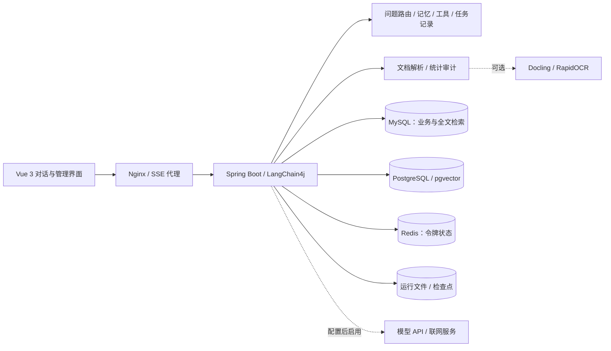

<div align="center">

# AIassistant

### 可追溯知识库与 AI 助手

从文档解析、混合检索到引用溯源、可核验统计与任务恢复的完整应用链路。


[快速部署](#快速部署) · [核心能力](#核心能力) · [架构](#架构) · [评测与边界](#评测与边界) · [部署指南](docs/public/DEPLOYMENT.md)

</div>

AIassistant 是一个面向个人资料管理与日常任务的全栈 AI 应用。它把“能回答”进一步扩展为“能查原文、核对统计过程、管理会话记忆、恢复中断任务”。项目包含 Vue 对话界面、Java 服务端、文档解析服务和数据库部署配置。

## 核心能力

| 能力 | 已实现内容 |
| --- | --- |
| 流式对话 | 多会话、SSE 回复、停止生成、深浅主题；模型支持时可切换四档思考强度 |
| 文档解析与索引 | PDF、Office、CSV、Markdown 等资料；PDFBox 文本提取，可选 Docling 版面解析与 RapidOCR；保留页码、来源及解析报告 |
| 混合检索 | pgvector 向量召回 + MySQL ngram 全文检索，结合资料范围过滤、相关性重排与上下文控制 |
| 引用溯源 | 按回答正文实际引用筛选来源，支持原文查看、页码定位；用户可主动触发引用支持性核验 |
| 可核验统计 | 在完整已解析表格上执行条件筛选、分组、去重及 BigDecimal 十进制聚合，保留行级审计与源文件定位 |
| 聊天记忆 | 当前会话内的事实、版本、来源消息与任务状态；支持查看、修改、删除、清空、暂停及项目范围隔离 |
| 任务恢复 | 保存文档处理进度及可复用结果，记录聊天与工具任务状态、步骤和结果；服务重启后提供手动继续入口 |
| 专题研究与工具 | 资料比较、联网补充、报告导出和文件工具；按问题特征选择本地计算、轻量请求或完整上下文路径 |
| 管理后台 | 用户与角色、模型配置、使用额度、日志和配置管理；JWT 鉴权，Redis 用于令牌撤销与刷新状态 |

> 检索使用 MySQL 全文检索实现词项召回；代码中部分历史字段沿用 `bm25` 命名，并不等同于独立 BM25 检索引擎。

## 架构



**技术栈**

- **服务端：** Java 17、Spring Boot 3、Spring Security、MyBatis-Plus、LangChain4j、Flyway、JWT。
- **数据层：** MySQL 8、PostgreSQL 16 + pgvector、Redis 7.4。
- **前端：** Vue 3、TypeScript、Vite、Pinia、Element Plus、ECharts。
- **解析：** Apache PDFBox、Apache POI、Tika；可选 Python 3.12、Docling、RapidOCR、FastAPI。
- **交付：** Docker 多阶段构建、Compose、Nginx、JUnit、Node 内置测试。

## 快速部署

需要 Git、Python 3 和支持 Linux 容器的 Docker Compose v2。首次构建需要下载镜像与依赖；基础服务建议预留至少 4 GB 可用内存，增强解析建议 8 GB 或更多，实际需求随资料大小变化。

```bash
git clone https://github.com/csm5143/AIassistant.git
cd AIassistant
python deployment/init-env.py
docker compose --env-file .env.docker up --build -d
```

打开 **http://localhost:8080**。管理员用户名为 `admin`，密码取自本机生成的 `.env.docker` 中 `BOOTSTRAP_ADMIN_PASSWORD`。生成器不会在终端显示密码，也不会覆盖已有配置。

1. 用管理员账户登录，打开管理页面的模型配置。
2. 配置对话模型的接口地址、模型名称与密钥。也可以在 `.env.docker` 中填写 `DEEPSEEK_KEY`，然后重新创建后端容器。
3. 配置嵌入模型。默认模板为 `BAAI/bge-m3`、**1024 维**；填入 `EMB_KEY`，或在管理界面保存密钥后重启后端。更换模型或维度需同步调整向量表并重新索引。
4. 创建知识库并上传自己的资料。仓库不包含用户数据、模型权重或预置知识库。

未配置模型密钥也可以启动并进入后台；依赖模型的请求需要先完成配置。默认关闭联网搜索与本机文件夹绑定。

### 可选：增强 PDF 解析

```bash
docker compose --env-file .env.docker --profile parser up --build -d
```

解析服务首次启动会下载版面、表格与 OCR 模型到独立数据卷，可能耗时较长。基础部署不启动该服务，PDF 文本提取仍可使用 PDFBox；扫描件识别及复杂版面效果取决于可用的解析与视觉配置。

### 可选：绑定本机资料目录

仅提供对 **`E:\资源`** 的只读绑定配置，需要主动启用；不会绑定其他个人目录。

```bash
docker compose --env-file .env.docker -f compose.yaml -f deployment/compose.local-folders.yaml up -d
```

容器内资料路径为 `/documents`。详见 [部署与备份](docs/public/DEPLOYMENT.md)。

## 评测与边界

项目把单元测试、真实资料验证和真实模型评测分开记录，避免用一次演示替代整体正确率。

| 历史评测场景 | 结果 | 适用范围 |
| --- | --- | --- |
| 长历史下的简单问答成本控制 | 10 题真实 API 对照中，输入 token **17,575 → 4,384，减少 75.1%** | 含合成历史的小样本；不代表所有问题、所有模型或整体延迟 |
| 完整表格统计核对 | 使用 **1,599 行真实 CSV** 与独立计算结果核对 | 验证表格统计与行定位，不等同于所有复杂 PDF 均可正确解析 |

以上属于已有本地评测记录摘要，**不是本次 Docker 发布的新功能验收结果**。本次发布验证和复现方法见 [评测说明](docs/public/EVALUATION.md)。公开源码不携带原始聊天记录、账号、评测结果数据或下载资料。

**当前边界**

- 引用出现不自动证明结论成立；支持性核验需用户触发，并可能增加模型调用。
- 统计基于完整的**已解析**表格，源文件漏页、OCR 错误或表格解析缺失仍可能影响结果。
- 记忆限定在当前会话，有容量与检索边界，不承诺无限记忆或跨会话全局记忆。
- 恢复以单后端实例及持久化数据卷为前提；聊天继续可能重新生成未完成部分，外部操作不承诺只执行一次。
- 模型与联网功能会向所配置的外部服务发送必要输入。API 费用由服务商计费，本项目不附带免费额度。
- 默认配置面向本机试用。公网部署前需设置 HTTPS、访问控制与备份策略，参见 [安全说明](SECURITY.md)。

## 项目结构

```text
backend/                 Java 服务、业务模块、数据库迁移与测试
user-frontend/           Vue 对话界面与管理页面
deployment/pdf-parser/   可选 Docling / RapidOCR 服务
deployment/nginx.conf    Web 与流式 API 代理
scripts/                公开发布检查与无模型调用冒烟测试
docs/public/            部署、评测与开发说明
compose.yaml            完整容器部署
```

## 本地开发与贡献

参见 [开发指南](CONTRIBUTING.md)。反馈问题时请提供版本、复现步骤及脱敏日志，不要粘贴密钥或私人资料。

README 的组织方式参考 [RAGFlow](https://github.com/infiniflow/ragflow) 与 [AnythingLLM](https://github.com/Mintplex-Labs/anything-llm) 的能力介绍和部署文档；功能说明以本项目实际实现为准。

## 许可证

遵循仓库已有的 [MIT License](LICENSE)。第三方组件、模型权重、数据集与模型服务遵循各自许可证及服务条款。
